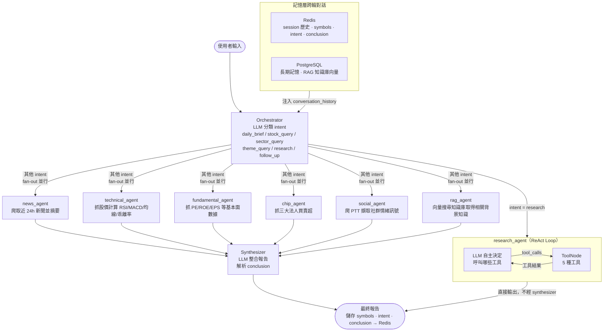

# Market Agent

台股智慧分析 Discord Bot，基於 **LangGraph multi-agent 架構**，整合即時新聞、技術面、基本面、籌碼面與社群訊號，生成有數據來源的投資分析報告。

> **每一筆數據都標注來源，不憑空生成數字。**

---

## 功能

- 📰 **即時新聞** — RSS（Bloomberg、FT、經濟日報、MoneyUDN）+ NewsAPI + GNews 多源整合，任一來源失敗不影響其他；Redis 快取 30 分鐘，重複查詢自動跳過爬蟲
- 🏭 **類股查詢** — 輸入「半導體」「傳產」「金融股」等關鍵字，自動從 TWSE 抓取該產業所有成份股（1077 檔 / 32 產業），fallback 至代表股清單
- 🎯 **概念股查詢** — 輸入「機器人」「元宇宙」「低軌衛星」「AI人工智慧」等主題，從 **CMoney 概念股分類**（159 個概念，涵蓋所有熱門題材）直接取得結構化個股清單；CMoney 無匹配時 fallback 至新聞關鍵字提取（鉅亨 + UDN）
- 📈 **技術面分析** — RSI、MACD、MA20/60、EMA12、乖離率、布林帶（yfinance + pandas-ta）；Redis 快取 30 分鐘，避免重複計算 ✅
- 📊 **基本面分析** — PE、PB、EPS、ROE、分析師評等（Yahoo Finance）；Redis 快取 24 小時 ✅
- 🧩 **籌碼面分析** — 三大法人買賣超（TWSE 公開 API）✅ | 融資融券 ⚠️ API 不穩定
- 💬 **社群訊號** — PTT Stock 板關鍵字監控（大單、訂單、法說等）
- 🧠 **RAG 知識庫** — pgvector 向量搜尋，自訂技術分析知識（需 Docker 啟動 DB）
- 💾 **頻道共用對話記憶** — Redis session 以頻道為單位共享，每則訊息附帶 `[username]` 前綴，LLM 能辨別不同使用者的發言並判斷是否為接話；每輪回覆儲存 `conclusion`、`symbols`、`intent`，支援跨使用者的 follow-up（「那聯發科呢？」即使是不同人問也能繼承話題）
- 🔍 **ReAct 研究模式** — 複雜/比較型問題（「比較半導體和航運哪個強」「找最值得買的機器人股」）自動進入 ReAct loop，LLM 自主決定呼叫哪些工具、呼叫幾次，直到得出結論；注入對話歷史，支援跨輪比較
- 📣 **法說會與技術新聞** — 鉅亨網個股搜尋，優先抓法說會、技術突破、產品相關報導，作為「獨家技術亮點」段落的唯一來源
- ⏰ **定時排程報告** — 每日自動在 08:30（盤前）、12:00（盤中）、14:30（收盤後）發送市場報告至指定 Discord 頻道；設定 `SCHEDULE_REPORT_CHANNEL_ID` 即可啟用，無需手動觸發
- 🤖 **LLM 可切換** — Ollama（本地）/ OpenAI / Gemini / Vertex AI / vLLM，改 `.env` 即可

---

## Multi-Agent 架構

Multi-agent 的核心定義在 **[`src/agents/graph.py`](src/agents/graph.py)**，使用 **LangGraph `StateGraph`** 實作。

### 流程圖

系統有**兩條執行路徑**，由 orchestrator 根據問題類型決定走哪條：



### 兩條路徑的關鍵差異

| | **一般查詢路徑** | **ReAct 研究路徑** |
|--|--|--|
| 觸發條件 | 單一明確問題（「台積電分析」「半導體類股」）| 複雜/比較型問題（「比較兩個產業」「找最強的股」）|
| 執行方式 | 固定 fan-out，所有 agent 並行跑完 | LLM 自主決定呼叫哪些工具、幾次 |
| 工具決策者 | Python 函數 `_route_after_orchestrator` | LLM 本身（ReAct loop）|
| 報告生成 | synthesizer 整合所有 agent 的結果 | research_agent 直接輸出 |
| 速度 | 快（固定路徑）| 較慢（動態迭代，最多 6 輪）|

### 各 Agent 說明

#### Graph Nodes（LangGraph 上的節點）

| 檔案 | 層級 | 職責 | 數據來源 |
|------|------|------|---------|
| [`orchestrator.py`](src/agents/orchestrator.py) | 入口 | intent 分類 + ticker/sector 提取 + 路由決策 | LLM + Redis |
| [`research_agent.py`](src/agents/research_agent.py) | 決策層（ReAct）| 複雜問題的 ReAct loop，LLM 自主呼叫工具直到得出結論 | LLM + 內建工具 |
| [`news_agent.py`](src/agents/news_agent.py) | 執行層 | 抓取近 24h 新聞（Redis 快取命中時跳過）| RSS / NewsAPI / GNews |
| [`technical_agent.py`](src/agents/technical_agent.py) | 執行層 | RSI、MACD、MA20/60、乖離率、BB + 法說會新聞 | yfinance + pandas-ta + 鉅亨網 |
| [`fundamental_agent.py`](src/agents/fundamental_agent.py) | 執行層 | PE、PB、EPS、ROE、分析師評等 | Yahoo Finance |
| [`chip_agent.py`](src/agents/chip_agent.py) | 執行層 | 三大法人買賣超 ✅ / 融資融券 ⚠️ | TWSE 公開 API |
| [`social_agent.py`](src/agents/social_agent.py) | 執行層 | PTT 關鍵字訊號 | PTT Stock |
| [`rag_agent.py`](src/agents/rag_agent.py) | 執行層 | 知識庫向量搜尋 | pgvector |
| [`synthesizer.py`](src/agents/synthesizer.py) | 整合層 | 整合所有 agent 結果，呼叫 LLM 生成報告 | 所有執行層 |

#### research_agent 內建工具（不是 graph nodes，是 ReAct 內部工具）

| 工具函數 | 對應的底層工具 |
|---------|-------------|
| `sector_lookup(keyword)` | `sector_data.get_sector_symbols()` |
| `theme_lookup(keyword)` | `theme_search.search_theme_stocks()` |
| `technical_analysis(symbol)` | `stock_data.get_technical_indicators()` |
| `fundamental_analysis(symbol)` | `stock_data.get_fundamental_data()` |
| `company_news(symbol)` | `company_insight.get_company_insights()` |

> **重要**：這些工具只存在於 `research_agent` 內部，不是 LangGraph graph 上的獨立節點。`research_agent` 是唯一有決策能力的節點，其他執行層 agent 只做固定的一件事。

### LangGraph 核心概念（對應程式碼）

```python
# src/agents/graph.py

builder = StateGraph(AgentState)          # 共享狀態定義於 state.py

builder.set_entry_point("orchestrator")

# Conditional fan-out：根據 intent 與 cache 狀態決定啟動哪些 agent
builder.add_conditional_edges(
    "orchestrator",
    _route_after_orchestrator,            # 回傳要執行的 node 名稱列表
    {node: node for node in _ALL_DATA_AGENTS},
)

# 所有 data agent 完成後 → synthesizer（自動 join）
for node in _ALL_DATA_AGENTS:
    builder.add_edge(node, "synthesizer")
```

**動態 routing**：`_route_after_orchestrator` 根據 `state.news_cached` 決定是否把 `news_agent` 加入 fan-out 清單。Redis 有新聞快取（TTL 30 分鐘）時，orchestrator 直接跳過 news_agent，節省 20–30 秒爬蟲時間。這是 LangGraph 相較傳統靜態 pipeline 的核心優勢：**每次執行的圖路徑可依 runtime 狀態動態調整**。

**共享狀態**（[`state.py`](src/agents/state.py)）：所有 agent 讀寫同一個 `AgentState`，使用 `operator.add` reducer 讓各 agent 的結果自動 append 合併，不互相覆蓋。

### 動態路由流程圖

```
第一次查詢（無快取）：
orchestrator → [news_agent, technical_agent, chip_agent, ...] → synthesizer
                      ↓
               爬蟲 + 存 Redis（TTL 30 min）

30 分鐘內再次查詢（快取命中）：
orchestrator → [technical_agent, chip_agent, social_agent, rag_agent] → synthesizer
                      ↑
               news_agent 被跳過，synthesizer 直接從 Redis 讀新聞
```

---

## 快速開始

### 前置需求

- Docker & Docker Compose
- Discord Bot Token（[Developer Portal](https://discord.com/developers/applications) 建立）

### 1. 設定環境變數

```bash
cp .env.example .env
```

最少需填：
```env
DISCORD_BOT_TOKEN=你的token
POSTGRES_PASSWORD=自訂密碼
```

### 2. 啟動服務

```bash
docker compose up -d
```

服務清單：
| 服務 | Port | 說明 |
|------|------|------|
| `app` | — | Discord bot 主程式 |
| `postgres` | 5432 | PostgreSQL + pgvector |
| `redis` | 6379 | Session cache |
| `ollama` | 11434 | 本地 LLM（預設） |

### 3. 拉取 LLM 模型

```bash
docker compose exec ollama ollama pull llama3.1:8b
```

### 4. 初始化知識庫（首次）

```bash
docker compose exec app python scripts/init_knowledge_base.py
```

### 5. 使用 Discord Bot

在 Discord 中：

| 指令 | 說明 |
|------|------|
| `/brief` | 今日市場摘要與投資建議 |
| `/stock 2330 2454` | 分析指定股票 |
| `/clear` | 清除對話記憶 |
| `/help` | 顯示說明 |
| 直接 @bot 問話 | 自由對話模式（支援跨使用者 follow-up）|

#### 啟用定時排程報告

在 `.env` 設定目標頻道 ID：

```env
SCHEDULE_REPORT_CHANNEL_ID=你的頻道ID   # 右鍵頻道 → 複製頻道 ID（需開啟開發者模式）
SCHEDULE_ENABLED=true                    # 預設已開啟
```

啟動後自動在以下時間發送報告：

| 時間 | 內容 |
|------|------|
| 08:30 | 盤前報告：昨收、隔夜美股、三大法人、今日開盤重點 |
| 12:00 | 盤中報告：目前指數與成交量、盤勢強弱、下午方向 |
| 14:30 | 收盤報告：今日漲跌幅、三大法人明細、明日操作建議 |

---

## 本地 CLI 測試（不需要 Discord）

不想設定 Discord Bot 時，可直接用 CLI 測試完整 agent pipeline：

```bash
python -m src.cli
```

| 指令 | 說明 |
|------|------|
| `/brief` | 今日市場摘要 |
| `/stock 2330 2454` | 分析指定股票 |
| `/schedule pre\|mid\|post` | 觸發排程報告（盤前／盤中／收盤後）|
| `/clear` | 清除當前 session |
| `/help` | 顯示說明 |
| 直接輸入問題 | 自由對話（支援 follow-up） |

> CLI 與 Discord Bot 使用同一套 `run_agent` pipeline，行為完全一致。DB 服務（PostgreSQL、Redis）需在 Docker 中運行；若未啟動，記憶與 RAG 功能自動降級，基本查詢仍可使用。

---

## 切換 LLM

只需修改 `.env`，不需改任何程式碼：

```env
# Ollama（本地，預設）
LLM_PROVIDER=ollama
LLM_MODEL=llama3.1:8b

# OpenAI
LLM_PROVIDER=openai
LLM_MODEL=gpt-4o-mini
OPENAI_API_KEY=sk-...

# Gemini（Developer API）
LLM_PROVIDER=gemini
LLM_MODEL=gemini-2.0-flash
GEMINI_API_KEY=...

# Vertex AI（GCP Application Default Credentials）
LLM_PROVIDER=vertex
LLM_MODEL=gemini-2.5-flash
GOOGLE_CLOUD_PROJECT=your-project-id
GOOGLE_CLOUD_LOCATION=us-central1
# 需先執行：gcloud auth application-default login

# vLLM（本地 OpenAI 相容）
LLM_PROVIDER=vllm
LLM_MODEL=mistral-7b
VLLM_BASE_URL=http://localhost:8000
```

---

## 專案結構

```
market-agent/
├── docker-compose.yml
├── Dockerfile
├── pyproject.toml
├── .env.example
├── data/
│   └── knowledge_base/          # 放 .md/.txt 會自動被 RAG 索引
│       └── technical_analysis_basics.md
├── scripts/
│   └── init_knowledge_base.py   # 初始化向量知識庫
└── src/
    ├── main.py                  # 啟動入口
    ├── config.py                # 所有設定（pydantic-settings）
    ├── llm.py                   # LLM 抽象層（LiteLLM + LangChain）
    ├── agents/
    │   ├── graph.py             # ★ LangGraph 圖定義（核心）
    │   ├── state.py             # 共享狀態 AgentState
    │   ├── orchestrator.py      # 路由 agent
    │   ├── news_agent.py
    │   ├── technical_agent.py
    │   ├── fundamental_agent.py
    │   ├── chip_agent.py
    │   ├── social_agent.py
    │   ├── rag_agent.py
    │   └── synthesizer.py       # 最終報告生成
    ├── tools/                   # 各數據源工具函數
    │   ├── news_fetcher.py      # RSS + NewsAPI
    │   ├── stock_data.py        # yfinance（價格、技術、基本面）
    │   ├── chip_data.py         # TWSE API（三大法人、融資融券）
    │   ├── social_signal.py     # PTT scraper
    │   ├── sector_data.py       # TWSE ISIN 類股查詢（官方產業分類）
    │   ├── cmoney_concept.py    # CMoney 概念股爬蟲（159 個主題分類）
    │   └── theme_search.py      # 主題搜尋（CMoney 優先 + 新聞 fallback）
    ├── memory/
    │   ├── models.py            # SQLAlchemy ORM（含 pgvector）
    │   ├── database.py          # async engine + session factory
    │   ├── session_store.py     # Redis 短期記憶
    │   └── conversation_repo.py # PostgreSQL 長期記憶
    ├── rag/
    │   ├── embedder.py          # sentence-transformers / OpenAI
    │   └── knowledge_store.py   # pgvector 存取 + 相似度搜尋
    └── bot/
        └── discord_bot.py       # Discord slash commands + 訊息處理
```

---

## 擴充指引

### 新增一個 Agent

1. 在 [`src/agents/`](src/agents/) 建立新檔案，實作 `async def your_agent_node(state: AgentState) -> dict`
2. 在 [`graph.py`](src/agents/graph.py) `build_graph()` 加入 `builder.add_node()`
3. 把新 agent 加入 `_ALL_DATA_AGENTS` 或在 `_route_after_orchestrator` 中指定觸發條件

### 新增知識庫文件

把 `.md` 或 `.txt` 放進 `data/knowledge_base/`，重新執行：
```bash
python scripts/init_knowledge_base.py
```

### 新增 Telegram 支援

在 `src/bot/` 建立 `telegram_bot.py`，直接呼叫 `from src.agents.graph import run_agent`，agent 核心完全共用。

---

## 技術棧

| 層 | 技術 |
|----|------|
| Agent 編排 | LangGraph 0.2+ |
| LLM 抽象 | LiteLLM + LangChain |
| 本地 LLM | Ollama / vLLM |
| 股票數據 | yfinance, pandas-ta |
| 台股籌碼 | TWSE 公開 API, goodinfo scraper |
| 新聞 | feedparser (RSS), NewsAPI |
| 社群訊號 | httpx + BeautifulSoup (PTT) |
| 向量搜尋 | pgvector + sentence-transformers (BAAI/bge-m3) |
| 對話記憶 | Redis（短期）+ PostgreSQL（長期） |
| Bot | discord.py 2.4+ |
| 部署 | Docker Compose |
