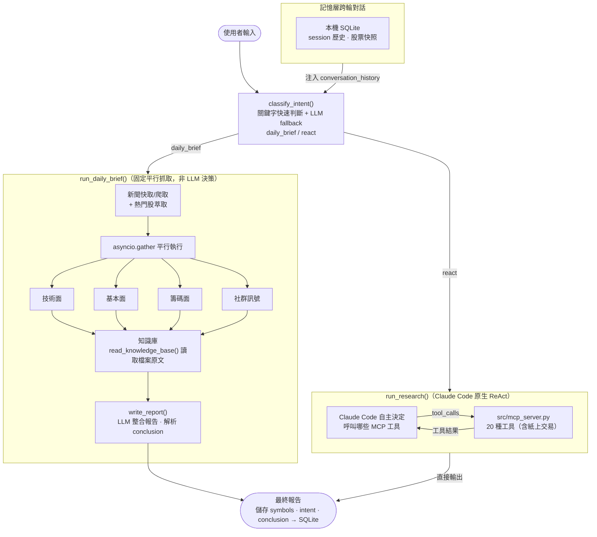

# Market Agent

台股智慧分析 Discord Bot，整合即時新聞、技術面、基本面、籌碼面與社群訊號，生成有數據來源的投資分析報告。

> **每一筆數據都標注來源，不憑空生成數字。**

---

## 功能

- 📰 **即時新聞** — RSS（Bloomberg、FT、經濟日報、MoneyUDN）+ NewsAPI + GNews 多源整合，任一來源失敗不影響其他；本機 SQLite 快取 30 分鐘，重複查詢自動跳過爬蟲
- 🏭 **類股查詢** — 輸入「半導體」「傳產」「金融股」等關鍵字，自動從 TWSE 抓取該產業所有成份股（1077 檔 / 32 產業），fallback 至代表股清單
- 🎯 **概念股查詢** — 輸入「機器人」「元宇宙」「低軌衛星」「AI人工智慧」等主題，從 **CMoney 概念股分類**（159 個概念，涵蓋所有熱門題材）直接取得結構化個股清單；CMoney 無匹配時 fallback 至新聞關鍵字提取（鉅亨 + UDN）
- 📈 **技術面分析** — RSI、MACD、MA5/10/20/60、EMA12、KD、量比（5日）、乖離率、布林帶（yfinance + pandas-ta）；本機 SQLite 快取 30 分鐘，避免重複計算 ✅
- 📊 **基本面分析** — PE、PB、EPS、ROE、分析師評等（Yahoo Finance）；本機 SQLite 快取 24 小時 ✅
- 🧩 **籌碼面分析** — 三大法人買賣超、投信/外資連續買超天數（TWSE 公開 API）✅ | 融資融券 ⚠️ API 不穩定
- 💬 **社群訊號** — CMoney 討論區個股貼文，摘要投資人關注議題與獨家技術亮點
- 📚 **知識庫** — `data/knowledge_base/` 放個人技術分析筆記，daily_brief 每次直接整篇讀入 prompt 當背景知識，內容量小不需要向量搜尋
- 💾 **頻道共用對話記憶** — SQLite session 以頻道為單位共享，每則訊息附帶 `[username]` 前綴，LLM 能辨別不同使用者的發言並判斷是否為接話；每輪回覆儲存 `conclusion`、`symbols`、`intent`，支援跨使用者的 follow-up（「那聯發科呢？」即使是不同人問也能繼承話題）
- 🔍 **ReAct 研究模式** — 複雜/比較型問題（「比較半導體和航運哪個強」「找最值得買的機器人股」）自動進入 ReAct loop，LLM 自主決定呼叫哪些工具、呼叫幾次，直到得出結論；注入對話歷史，支援跨輪比較
- 📣 **法說會與技術新聞** — 鉅亨網個股搜尋，優先抓法說會、技術突破、產品相關報導，作為「獨家技術亮點」段落的唯一來源
- ⏰ **定時排程報告** — 每日自動在 08:30（盤前）、12:00（盤中）、14:30（收盤後）發送市場報告至指定 Discord 頻道；設定 `SCHEDULE_REPORT_CHANNEL_ID` 即可啟用，無需手動觸發
- 🧪 **紙上交易迴圈**（實驗性）— 交易時間內背景自動運作；程式固定並行抓技術面、基本面、籌碼、公告與新聞，每輪最多兩檔，再交給 LLM 做一次結構化 JSON 決策，由風控層驗證後才交給 PaperBroker。機械式停損與條件單每分鐘獨立運作；每日呼叫數與超時熔斷避免 Codex 無法回報美元成本時失控。完整設計見 [`docs/paper_trading.md`](docs/paper_trading.md)
- 🤖 **LLM 後端** — 可切換 **Claude Code CLI** 或 **Codex CLI**，使用各 CLI 的本機登入

---

## 架構

系統只有**兩條執行路徑**，由 [`pipeline.py`](src/agents/pipeline.py) 的 `classify_intent()` 決定走哪條 —— 沒有 graph 框架，就是一個 `if/else`：


```mermaid
flowchart TD
    subgraph MEM["記憶層跨輪對話"]
        SQLITE["本機 SQLite\nsession 歷史 · 股票快照"]
    end

    USER([使用者輸入]) --> CLS

    MEM -->|注入 conversation_history| CLS

    CLS["classify_intent()\n關鍵字快速判斷 + LLM fallback\ndaily_brief / react"]

    CLS -->|react| RA
    CLS -->|daily_brief| DB

    subgraph RA["run_research()（Claude Code 原生 ReAct）"]
        LLM_R["Claude Code 自主決定\n呼叫哪些 MCP 工具"] -->|tool_calls| MCP["src/mcp_server.py\n20 種工具（含紙上交易）"]
        MCP -->|工具結果| LLM_R
    end

    subgraph DB["run_daily_brief()（固定平行抓取，非 LLM 決策）"]
        NEWS["新聞快取/爬取\n+ 熱門股萃取"] --> FANOUT
        FANOUT["asyncio.gather 平行執行"] --> TA["技術面"] & FA["基本面"] & CA["籌碼面"] & SA["社群訊號"]
        TA & FA & CA & SA --> KB["知識庫\nread_knowledge_base() 讀取檔案原文"]
        KB --> SYN["write_report()\nLLM 整合報告 · 解析 conclusion"]
    end

    RA -->|直接輸出| END([最終報告\n儲存 symbols · intent · conclusion → SQLite])
    SYN --> END
```

### 兩條路徑的關鍵差異

| | **daily_brief** | **react** |
|--|--|--|
| 觸發條件 | 明確要每日市場摘要（「早安」「盤前」「今日總結」等關鍵字，且沒有提到股票/題材）| 其他所有問題：個股、產業、主題、歷史、比較、follow-up |
| 執行方式 | 固定平行抓取全部 6 種資料來源，**不經過 LLM 決定要抓什麼** | Claude Code 自主決定呼叫哪些 MCP 工具、呼叫幾次 |
| 為什麼要分開 | 排程無人值守（08:30/12:00/14:30），`claude -p` 沒有強制呼叫工具的機制，讓 LLM 自己決定「要不要查」有靜默漏查的風險——見 [ADR 0001](docs/adr/0001-drop-langgraph-delegate-to-claude-code.md) | 已經是 Claude Code 原生 agentic loop，沒有再包一層決策的必要 |
| 報告生成 | `write_report()` 整合所有資料呼叫 LLM 寫報告 | Claude Code 直接輸出，不經過 synthesizer |

### 檔案對應

| 檔案 | 職責 |
|------|------|
| [`pipeline.py`](src/agents/pipeline.py) | intent 分類（規則 + LLM fallback）、`run_agent()` 對外入口、錯誤處理 |
| [`daily_brief.py`](src/agents/daily_brief.py) | daily_brief 的固定抓取流程：新聞、熱門股萃取、技術/基本面/籌碼/社群平行抓取 + 知識庫讀取 |
| [`research_agent.py`](src/agents/research_agent.py) | react 的 ReAct 迴圈，組裝對話歷史後交給 Claude Code 原生 tool-calling |
| [`synthesizer.py`](src/agents/synthesizer.py) | `write_report()`：把 daily_brief 蒐集到的資料整理成表格 + 呼叫 LLM 生成分析文字 |
| [`market_agent.py`](src/agents/market_agent.py) | 熱門股萃取用的輔助函數（TWSE 代號表快取、候選股篩選、LLM 選股）|

### research_agent 呼叫的 MCP 工具

| 工具函數 | 對應的底層工具 |
|---------|-------------|
| `sector_lookup(keyword)` | `sector_data.get_sector_symbols()` |
| `theme_lookup(keyword)` | `theme_search.search_theme_stocks()` |
| `technical_analysis(symbol)` | `stock_data.get_technical_indicators()` |
| `fundamental_analysis(symbol)` | `stock_data.get_fundamental_data()` |
| `company_news(symbol)` | `company_insight.get_company_insights()` |
| `web_search(query, max_results)` | `web_search.search_web()`（自己下關鍵字，僅供參考背景） |
| `company_announcements(symbol)` | `mops_data.get_material_info()`（TWSE MOPS，只有今天） |
| `company_financial_summary(symbol)` | `mops_data.get_financial_summary()`（TWSE MOPS，只有最新一季） |
| `paper_trade_status()` | 查詢紙上交易目前持倉與損益，含模擬帳戶可用現金/總資產 |
| `paper_trade_buy(symbol, reason, horizon, allocation_pct)` | 開一筆紙上交易買進部位，價格用即時真實股價，horizon 選短線/長期，allocation_pct 為押多少 % 模擬本金（agent 自訂，系統夾在允許範圍內） |
| `paper_trade_sell(symbol, reason, exit_reason)` | 對持有部位平倉，價格用即時真實股價 |
| `watchlist_drop(symbol, reason)` | 把股票從觀察名單移除，agent 自行判斷不用再追蹤 |
| `paper_trade_set_condition(symbol, indicator, operator, threshold, action, ...)` | 設定條件單，系統每 tick 機械式檢查真實數據，成立就直接執行買/賣，不用再花一次 LLM 呼叫確認 |
| `paper_trade_cancel_condition(condition_id)` | 取消一筆還沒觸發的條件單 |

> 完整清單（含 Discord/Gmail 訊息工具，共 20 個）見 [`src/mcp_server.py`](src/mcp_server.py)。紙上交易的完整運作方式（背景迴圈、廣掃/緊盯頻率、架構圖）見 [`docs/paper_trading.md`](docs/paper_trading.md)。

---

## 快速開始

### 前置需求

- Discord Bot Token（[Developer Portal](https://discord.com/developers/applications) 建立）
- 已安裝並登入所選後端：Claude Code CLI（`claude`）或 Codex CLI（`codex`）
- [uv](https://docs.astral.sh/uv/)（Python 套件管理與執行）

### 1. 設定環境變數

```bash
cp .env.example .env
```

最少需填：
```env
DISCORD_BOT_TOKEN=你的token
```

### 2. 安裝依賴並啟動

```bash
uv sync
uv run python -m src.main
```

> 記憶、快取都是本機一個 SQLite 檔案（`data/market_agent.db`，可用 `DB_PATH` 調整），不需要另外啟動任何資料庫服務。知識庫（`data/knowledge_base/`）放檔案進去就直接生效，不需要初始化指令。

### 3. 使用 Discord Bot

在 Discord 中：

| 指令 | 說明 |
|------|------|
| `/brief` | 今日市場摘要與投資建議 |
| `/stock 2330 2454` | 分析指定股票 |
| `/performance` | 查看紙上交易迴圈的持倉與損益（見 [`docs/paper_trading.md`](docs/paper_trading.md)）|
| `/watchlist` | 查看目前仍在追蹤、尚未買進的股票 |
| `/status` | 紙上交易唯讀總覽：backend、現金、資產、持倉、觀察名單與條件單 |
| `/log [筆數]` | 查看最近 1–50 筆紙上交易執行紀錄，預設 20 筆 |
| `/clear` | 清除對話記憶 |
| `/help` | 顯示說明 |
| 群組頻道：@bot 問話 | 自由對話模式（支援跨使用者 follow-up）|
| 私訊（DM）：直接打字，不用 @bot | 一對一對話模式，同樣支援 follow-up |

> **DM 模式須知**：`on_message` 已原生支援 DM 自由文字對話（[`src/bot/discord_bot.py`](src/bot/discord_bot.py) 的 `isinstance(message.channel, discord.DMChannel)` 判斷），不需要額外設定。但要能收到 DM 內文，需在 [Discord Developer Portal](https://discord.com/developers/applications) → 你的 App → **Bot** 頁 → **Privileged Gateway Intents** 區塊，手動開啟 **Message Content Intent** 並存檔——這個設定無法純靠程式碼開啟，光有 `intents.message_content = True` 不夠。改完設定要重啟 bot 才生效。
>
> Slash command（`/brief` 等）能否在 DM 使用，取決於 bot 的安裝方式（Guild Install vs User Install），請至 Developer Portal 的 **Installation** 頁確認。

#### 啟用定時排程報告

在 `.env` 設定目標頻道 ID：

```env
SCHEDULE_REPORT_CHANNEL_ID=你的頻道ID   # 右鍵頻道 → 複製頻道 ID（需開啟開發者模式）
SCHEDULE_ENABLED=true                    # 預設已開啟
```

啟動後自動在以下時間發送報告：

| 時間 | 內容 |
|------|------|
| 08:30 | 盤前報告：昨收、隔夜美股、三大法人、今日開盤重點 |
| 12:00 | 盤中報告：目前指數與成交量、盤勢強弱、下午方向 |
| 14:30 | 收盤報告：今日漲跌幅、三大法人明細、明日操作建議 |

#### 啟用紙上交易迴圈（實驗性）

```env
PAPER_TRADING_ENABLED=true
```

啟動後在交易時間內（週一~五 09:00-13:30）自動背景運作，用 `/performance` 查看目前持倉與績效。不需要額外的帳號或憑證——完整運作方式見 [`docs/paper_trading.md`](docs/paper_trading.md)。

為避免一次研究整份觀察名單造成 MCP timeout，緊盯循環每輪最多研究 3 檔並公平輪詢；失敗會記錄成 `research_failed`，可用 `/log` 查看。

---

## 本地 CLI 測試（不需要 Discord）

不想設定 Discord Bot 時，可直接用 CLI 測試完整 agent pipeline：

```bash
uv run python -m src.cli
```

| 指令 | 說明 |
|------|------|
| `/brief` | 今日市場摘要 |
| `/stock 2330 2454` | 分析指定股票 |
| `/schedule pre\|mid\|post` | 觸發排程報告（盤前／盤中／收盤後）|
| `/status` | 紙上交易帳戶終端面板（持倉/現金/報酬率/觀察名單/條件單），見 [`docs/paper_trading.md`](docs/paper_trading.md) |
| `/log <N>` | 紙上交易稽核紀錄（廣掃/緊盯/停損/條件單/買賣/花費警告），預設最近 20 筆 |
| `/clear` | 清除當前 session |
| `/help` | 顯示說明 |
| 直接輸入問題 | 自由對話（支援 follow-up） |

`/status` 是唯讀查詢，可以在 `python -m src.main`（Discord bot + 紙上交易迴圈）運行時另開一個終端機跑 `python -m src.cli` 觀察，兩邊共用同一個 SQLite 檔案，互不干擾。

> CLI 與 Discord Bot 使用同一套 `run_agent` pipeline，行為完全一致。記憶／快取都是本機 SQLite 檔案，沒有額外服務需要啟動。

---

## LLM 後端

透過 `.env` 的 `LLM_BACKEND=claude|codex` 選擇本機 CLI。預設維持 Claude；切換 Codex 時可另外設定 `CODEX_MODEL` 與 `CODEX_REASONING_EFFORT`。兩種後端都使用 CLI 已登入的帳號，本專案不保存 API key。

```env
LLM_BACKEND=codex
CODEX_MODEL=                    # 留空使用 Codex 本機預設
CODEX_REASONING_EFFORT=medium
```

### 兩種呼叫形狀

| 用途 | 函數 | 機制 | 使用位置 |
|------|------|------|---------|
| 單次分類/擷取/報告生成（無工具） | `llm_chat()` | 由 facade 路由至所選 CLI | pipeline（intent 分類）、market_agent（熱門股擷取）、synthesizer（報告生成）|
| 需要即時查資料的 ReAct 迴圈 | `llm_research()` | 將 [`src/mcp_server.py`](src/mcp_server.py) 設為 MCP server，交給所選 CLI 執行 | research_agent、paper_trading_loop |

> Claude CLI 會提供 `total_cost_usd`，可納入紙上交易的每日美元預算。Codex CLI 目前沒有等價的美元成本輸出，因此使用 Codex 時 `PAPER_TRADING_DAILY_BUDGET_USD` 無法統計 Codex 呼叫成本，程式會寫入警告而不會虛構金額。

Codex 的研究呼叫會用目前虛擬環境的 Python 絕對路徑啟動本機 STDIO MCP server，
不依賴子程序的 `uv`/`python` PATH。MCP 啟動上限為 30 秒並設為必要服務；若初始化失敗，
該輪會明確報錯而不是在沒有研究工具的情況下繼續產生交易判斷。

## 行情來源

紙上交易的買賣參考價、機械停損、條件單與持倉估值都透過
`MarketDataProvider` 取得，不直接依賴 Yahoo。現在唯一實作是
`YahooMarketDataProvider`；歷史 K 線與技術指標仍由 Yahoo 提供。

```env
MARKET_DATA_PROVIDER=yahoo
```

這個接縫預留給之後新增唯讀的 `ShioajiMarketDataProvider`：即時行情可以換成
Shioaji，而交易執行仍維持 `PaperBroker` 與 SQLite 模擬持倉。

> **為什麼分兩種**：早期曾嘗試用純文字 prompt 要求 `claude -p` 輸出 `{"action": "...", "args": {...}}` 這種自訂 JSON 協議來模擬 tool-calling，實測約 30–40% 時候會失敗——`claude -p` 背後是完整的 agent runtime，不是單純的文字補全 API，遇到「不確定工具是否真的存在」的情境會自行幻想/扮演整個工具呼叫與回傳結果。改用真正的 MCP tool-calling 後，這個失敗模式完全消失（測試中連續 10/10 次正確執行，含多工具串接）。單次分類這類「不需要工具」的呼叫則沒有這個問題，維持純文字 `claude -p` 即可穩定運作。

---

## 專案結構

```
market-agent/
├── pyproject.toml
├── .env.example
├── data/
│   ├── market_agent.db          # 本機 SQLite（session/快取/股票快照，執行後自動建立）
│   └── knowledge_base/          # 放 .md/.txt，daily_brief 會整篇讀入
└── src/
    ├── main.py                  # 啟動入口（Discord bot + 排程 + 紙上交易迴圈）
    ├── cli.py                   # 本地 CLI（不需 Discord）+ /status 終端面板
    ├── config.py                # 所有設定（pydantic-settings）
    ├── llm_claude_code.py       # Claude Code CLI 後端（claude_code_chat / claude_code_research）
    ├── mcp_server.py            # MCP server：暴露 20 個工具給 claude -p --mcp-config 呼叫
    ├── agents/
    │   ├── pipeline.py          # ★ intent 分類 + run_agent() 對外入口
    │   ├── daily_brief.py       # daily_brief 固定平行抓取流程
    │   ├── research_agent.py    # react 的 ReAct 迴圈（交給 Claude Code）
    │   ├── market_agent.py      # 熱門股萃取輔助函數
    │   ├── synthesizer.py       # write_report()：整合資料 + 生成報告
    │   ├── paper_trading_loop.py # 紙上交易背景迴圈：廣掃/緊盯/機械式停損/條件單檢查（見 docs/paper_trading.md）
    │   └── paper_trading.py     # 損益計算 + evaluate_paper_trades() + 資金模擬（simulate_portfolio_equity）
    ├── tools/                   # 各數據源工具函數
    │   ├── news_fetcher.py      # RSS + NewsAPI
    │   ├── stock_data.py        # yfinance（價格、技術指標、基本面）
    │   ├── chip_data.py         # TWSE API（三大法人、投信/外資連續買超天數、融資融券）
    │   ├── cmoney_forum.py      # CMoney 討論區爬蟲（社群訊號）
    │   ├── sector_data.py       # TWSE ISIN 類股查詢（官方產業分類）
    │   ├── cmoney_concept.py    # CMoney 概念股爬蟲（159 個主題分類）
    │   ├── theme_search.py      # 主題搜尋（CMoney 優先 + 新聞 fallback）
    │   ├── web_search.py        # 開放網頁搜尋（DuckDuckGo）
    │   ├── mops_data.py         # TWSE MOPS 官方揭露（重大訊息/財報，今日快照）
    │   ├── paper_trading_actions.py # 紙上交易下單邏輯：buy/sell/set_condition（見 docs/paper_trading.md）
    │   ├── broker.py             # Broker 介面（執行層的抽象，見 docs/adr/0002）
    │   ├── paper_broker.py       # Broker 的模擬實作（寫進 paper_positions）
    │   └── knowledge_base.py    # 讀取 data/knowledge_base/ 檔案原文
    ├── memory/
    │   ├── store.py             # SQLite schema + connection helper
    │   ├── cache_store.py       # 通用 TTL 快取（新聞/股票 API）
    │   ├── session_store.py     # 頻道對話 session（SQLite）
    │   ├── stock_store.py       # 每日股票快照 upsert + 歷史查詢
    │   └── paper_trading_store.py # 紙上交易部位/觀察名單/條件單/稽核紀錄（開倉/平倉/set_condition/log_event）
    └── bot/
        └── discord_bot.py       # Discord slash commands + 訊息處理
```

---

## 擴充指引

### 新增一個資料來源

- **daily_brief 要用**：在 [`daily_brief.py`](src/agents/daily_brief.py) 加一個新的 `async def _xxx(symbols)` 抓取函數，加進 `run_daily_brief()` 的 `asyncio.gather()` fan-out，並在 [`synthesizer.py`](src/agents/synthesizer.py) 的 `write_report()` 加對應參數與 `_summarize_xxx()` 表格函數
- **react 要用**：不需要碰 `daily_brief.py`，直接看下面「新增一個 MCP 工具」

### 新增知識庫文件

把 `.md` 或 `.txt` 放進 `data/knowledge_base/` 就好，下次 `/brief` 或排程報告執行時會自動整篇讀入，不需要額外指令。

### 新增 Telegram 支援

在 `src/bot/` 建立 `telegram_bot.py`，直接呼叫 `from src.agents.pipeline import run_agent`，agent 核心完全共用。

### 新增一個 MCP 工具（給 Claude Code ReAct 用）

`research_agent` 的工具清單來自 [`src/mcp_server.py`](src/mcp_server.py)，用 `@mcp.tool()` 註冊。新增工具時：

1. 在 `mcp_server.py` 用 `@mcp.tool()` 註冊
2. 邏輯本體放在 `src/tools/*.py`，工具函數只做參數轉換與呼叫

### 已知的資料品質注意事項

網頁爬蟲類工具（`sector_data.py`、`theme_search.py`/`cmoney_concept.py`）依賴目標網站的 HTML class 結構，改版會直接讓工具失效或混入雜訊，且不會拋錯——回傳的清單長度看起來正常，內容卻可能不對。曾發生過的實例：`cmoney_concept.py` 的選股器一度沒有限定在概念股表格區塊內，導致把導覽列固定連結（如台積電、大盤 ETF）也當成任一主題的成分股回傳，兩個完全不相關的主題查詢結果有一半重疊卻毫無察覺（見 commit `ee64efa`）。修改或新增這類爬蟲工具後，建議至少手動跑兩個不同關鍵字比對結果、確認沒有異常重疊，而不是只看「有沒有回傳資料」。

---

## 技術棧

| 層 | 技術 |
|----|------|
| Agent 編排 | 純 asyncio（daily_brief 固定 fan-out）+ Claude Code 原生 ReAct（react） |
| LLM | Claude Code CLI（`claude -p` + MCP tool-calling） |
| 股票數據 | yfinance, pandas-ta |
| 台股籌碼 | TWSE 公開 API, goodinfo scraper |
| 新聞 | feedparser (RSS), NewsAPI |
| 社群訊號 | httpx + BeautifulSoup (CMoney 討論區) |
| 開放搜尋／官方揭露 | DuckDuckGo + TWSE MOPS OpenAPI |
| 對話記憶／快取／股票快照／知識庫 | SQLite（本機單一檔案） |
| Bot | discord.py 2.4+ |
| 部署 | `uv run python -m src.main` |
