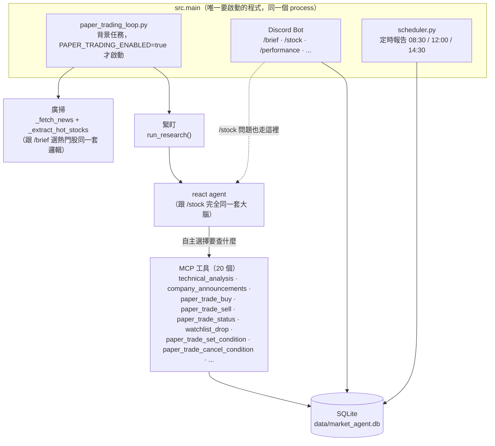
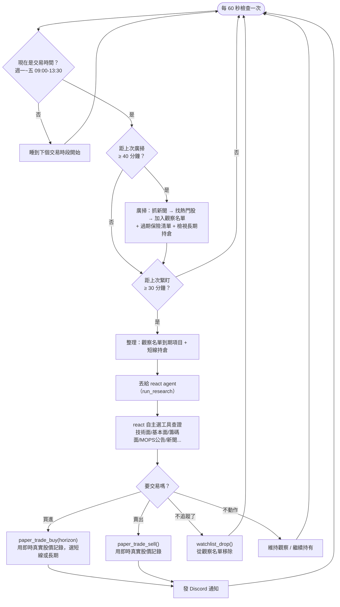

# 紙上交易迴圈（Paper Trading Loop）

實驗性功能：在台股交易時間內持續運作、自己判斷買賣的模擬交易背景任務。完全不牽涉真實資金或第三方交易帳戶——原本評估過接 CMoney 大富翁模擬帳戶，但它的登入系統已經換成 OIDC，唯一的第三方套件已經失效多年，所以改成自己記帳、自己算損益。

## 跟核心功能的關係

**只有一個程式要啟動：`uv run python -m src.main`**。紙上交易迴圈是這個 Discord bot 啟動時，依 `.env` 的 `PAPER_TRADING_ENABLED` 開關決定要不要一起以背景任務啟動——不是另一個要分別啟動的程式。

之後如果要正式上線自動交易，只要把 `PAPER_TRADING_ENABLED` 關掉，核心的查股票/`/brief`/`/stock` 功能完全不受影響——這是特意這樣設計的：`paper_trading_loop.py` 是獨立模組，跟 `/brief` 那條固定抓取路徑不共用 prompt、不共用觸發時機；跟 `/stock` 用的則是**同一套** react 大腦，只是多了六個工具可以用（`paper_trade_status/buy/sell`、`watchlist_drop`、`paper_trade_set_condition/cancel_condition`）。

真正要留意的 trade-off：因為現在共用同一個 process，紙上交易迴圈如果哪天真的丟出沒接住的例外把整個 process 弄掛，Discord bot 也會跟著死掉（反之亦然）。`run()` 已經把每個週期包在 try/except 裡、錯誤只會被記錄不會往外炸，風險不高，但這是唯一真的要拿來換的東西。

### 執行層是可以替換的（`Broker` 介面）

`paper_trade_buy`/`sell` 背後的 `buy()`/`sell()`（`src/tools/paper_trading_actions.py`）只負責業務規則（部位上限、分配額度計算、格式驗證），真正「執行交易」的部分抽成一個獨立的 `Broker` 介面（`src/tools/broker.py`），現在唯一的實作是 `PaperBroker`（`src/tools/paper_broker.py`，寫進 `paper_positions` 這張模擬帳本）。這是為了以後如果要接真實券商（例如永豐金 Shioaji）鋪路——寫一個新的 `ShioajiBroker` 實作同樣的介面，`buy()`/`sell()` 的業務規則完全不用改。

但這不代表「換一個 class 就能無痛切換成真的下單」——`docs/adr/0002-execution-backend-seam.md` 記錄了兩個目前刻意先不解決的落差：真實下單是非同步的（Shioaji 送出訂單後用 callback 通知成交，不是像現在這樣查到價格就假設成交）、現金的真相來源不一樣（真實帳戶要問券商 API，不是我們自己算的模擬帳本）。而且機械式停損/條件單「完全自動觸發、不經過人」這個設計，前提是「反正沒有真的錢」——真的要接真實下單時，這個風險胃口需要重新討論，不是介面換掉就自動安全。

## 決策依據什麼資訊——為什麼交給 react 而不是固定 prompt

一開始的設計是「固定抓技術面/基本面/籌碼面數據，餵給一個專屬的小 prompt 判斷」——保證每次都不會漏查，但看到的資料範圍被寫死。討論後改成現在這樣：**候選股怎麼找是固定的（廣掃），但買賣怎麼判斷交給 react 自己決定要查什麼**（跟你直接問「台積電要不要買」用的是同一套 `run_research()`）。

這牽涉一個明確的取捨，值得寫下來：`claude -p` 沒有辦法強制它一定要呼叫某個工具（沒有 API 那種 `tool_choice` 參數），所以讓它自由選工具，代表理論上某一輪它可能「懶得查」MOPS 公告——這正是 [ADR 0001](adr/0001-drop-langgraph-delegate-to-claude-code.md) 當初把 `daily_brief` 做成固定抓取、不讓 LLM 決定要不要查的理由。紙上交易迴圈是無人值守自動跑的，跟 `daily_brief` 是同一種情境，理論上也該用固定抓取——但這裡刻意選了跟 `react` 一樣的自由工具模式，因為看得到的資訊範圍更完整（新聞、MOPS、社群訊號都能自己查），對「要不要交易」這種需要綜合判斷的決策更合適，而且已經在 `REACT_SYSTEM` 裡加了規則要求它下單前務必先查證真實數據（見下方流程圖的「自主選擇」節點）。實測一輪緊盯可能跑到 20 個 agentic turns、花費比固定 prompt 版本高好幾倍，這是換來的真實代價。

### 交易工具跟查詢工具的清單是分開的

因為交易決策也是走 `run_research()`（跟 `/stock` 同一個函式），一開始 `paper_trade_buy`/`paper_trade_sell` 是跟 `technical_analysis` 那些查詢工具放在同一份工具清單裡——代表你打 `/stock 2330` 只是想看技術面，Claude 手上卻也拿得到下單工具，理論上可能「順便」幫你買一張。

修法是把工具清單拆成兩份（`src/llm_claude_code.py`）：

- `USER_FACING_TOOL_NAMES`（14 個，不含交易工具）—— `run_research()` 的預設值，`/stock`、自由問答都用這份
- `PAPER_TRADING_TOOL_NAMES`（產業／題材、研究、紙上交易工具）—— 只有
  `paper_trading_loop.py` 呼叫 `run_research()` 時明確傳入這份；不包含 Discord 與 Gmail，
  避免把無關工具 schema 一起送進每輪決策

紙上交易另外使用較精簡的 `PAPER_TRADING_SYSTEM`。它保留產業／題材、技術面、基本面、
籌碼、公告、條件單與風控規則，但移除一般助理的訊息／郵件操作說明。`paper_trade_buy`
還有工具層硬性閘門：同一輪對同一檔股票必須成功完成 `technical_analysis`、
`fundamental_analysis`、`chip_analysis`、`company_announcements`，缺一項就拒絕買入；
因此 prompt 要求即使被模型忽略，也不會直接成交。

這樣「查股票」的對話**物理上**沒有下單工具可以用，不是靠 prompt 裡寫規則約束。

### 個人策略筆記也會納入判斷

`data/knowledge_base/` 底下的個人交易筆記（均線、KD、籌碼、型態學等判斷邏輯），一開始只有 `daily_brief.py` 自己讀進去用，紙上交易迴圈完全看不到——這是分開各自接的架構問題，之後只會漏接或內容兜不起來。改法是把它接在共用的入口：`research_agent.py` 的 `run_research()` 每次呼叫都會重新讀取（不快取，改筆記不用重啟就生效）並附加到 system prompt 裡。因為 `/stock` 和紙上交易迴圈都走同一個 `run_research()`，這份筆記變成整個 react 路徑的固定背景知識，不用每個呼叫點各自記得加。`daily_brief.py` 維持原本自己讀取的方式，因為它本來就是獨立一條路。

**注入是無條件的，不分 `/stock` 還是交易迴圈**。中途試過只在 `tool_names` 含交易工具時才附加（省 token 成本，`/stock` 純查詢不用多付這筆），但後來推翻了：這份筆記是使用者自己的判斷標準，不是可有可無的參考資料——如果 `/stock` 問「2330 該不該買？」這種判斷型問題卻看不到筆記，等於漏掉使用者最在意的判斷依據，跟一開始想解決的「agent 只靠自身訓練知識判斷」是同一個問題。筆記約 17KB（幾千個 token）的成本，被視為換取「保證不漏看」的合理代價。

## 運作方式

只在台股交易時間內動作（週一到週五 09:00–13:30，其餘時間直接睡到下個交易時段開始，不會浪費 API 成本查休市的行情）。

持有中的部位跟觀察名單用同一個「緊盯」頻率查（每 30 分鐘）——但**只有短線（`short_term`）部位**才會進緊盯；長期持有（`long_term`）的部位改成跟廣掃同一個頻率（40 分鐘）才檢視一次，這是「短打盯緊、長抱放寬」的具體做法。要買長線還是短打，是 react 呼叫 `paper_trade_buy` 時自己判斷、自己指定的。機械停損與條件單仍每 60 秒檢查，不受這個 LLM 頻率調整影響。

進出場價格一律來自 `paper_trade_buy`/`paper_trade_sell` 工具自己即時查到的真實股價，不是 LLM 自己講的數字——跟這專案其他所有功能同一個原則。

## 資金模擬——不只看單筆 % 報酬，也看真實資金會怎麼變

一開始績效只有 `evaluate_paper_trades()` 算的「每筆漲跌幾 %」（`win_rate`/`avg_return_pct`）——這個指標很乾淨，跟部位大小無關，適合看「選股/進出場判斷準不準」，但看不出「如果拿真的錢照這個策略操作，帳戶會變多少」。現在疊加一層資金模擬，**兩者並存、互不取代**：

- `.env` 的 `PAPER_TRADING_STARTING_CAPITAL`（預設 500,000）設定模擬帳戶的起始本金
- `paper_trade_buy` 多一個 `allocation_pct` 參數——這筆要押多少 % 本金，由 agent 自己依信心程度判斷（跟 `horizon` 一樣是 agent 的策略判斷，不是查證得到的市場數據）；系統用 `PAPER_TRADING_MIN_ALLOCATION_PCT`/`PAPER_TRADING_MAX_ALLOCATION_PCT`（預設 5%~20%）自動夾住，避免一次判斷失常就重壓單一檔
- 股數 = 分配金額 ÷ 進場價，一律用整股計算，紀錄在 `paper_positions` 的 `shares`/`allocation_amount` 欄位（下單當下就固定，之後就算調整 `.env` 的百分比範圍也不會回頭影響已經開的部位）
- 模擬現金不夠分配這筆，`paper_trade_buy` 直接拒絕——這是比 20 檔持倉上限更早發生作用的真實限制
- `src/agents/paper_trading.py` 的 `get_available_cash()`/`simulate_portfolio_equity()` 都是**重播 `paper_positions` 的紀錄現算**，不是另外存一個會漂移的現金餘額欄位——`paper_positions` 本身就是唯一真相來源

`simulate_portfolio_equity()` 也會算「已平倉最大回撤」，但這裡誠實講一個限制：因為沒有存逐日的權益快照，這個回撤只能從「每次平倉時的已實現損益」重建曲線，不包含還持有中部位期間的浮動震盪——不是真正連續的權益曲線，只是一個實用的近似值。

`/performance` 跟 `paper_trade_status`（agent 下單前查額度用）都看得到：可用現金、目前總資產、累計報酬、已平倉最大回撤。

## 持倉上限——防失控，不是操作上限

`paper_trade_buy` 一開始沒有任何數量限制，agent 理論上可以一路買下去。現在短線（`short_term`）跟長期（`long_term`）部位**各自獨立設上限**（`.env` 的 `PAPER_TRADING_MAX_SHORT_TERM_POSITIONS`/`PAPER_TRADING_MAX_LONG_TERM_POSITIONS`，預設各 20 檔），不是兩種合計一個總量——這樣短線頻繁進出不會把長期持有的額度吃光。達上限時 `paper_trade_buy` 直接回傳錯誤，agent 看到錯誤訊息後必須先賣出既有部位才能再買，不會硬闖。

刻意設得寬鬆（20 檔，不是像 5 檔那種平常就會碰到的數字）：紙上交易不牽涉真實資金，「市場真的很好、agent 想多買幾檔」不該被擋，真正要防的是 bug 或誤判造成的無限亂買——跟 `WATCHLIST_TTL` 同一種「硬規則當最後一道保險，不是日常操作限制」的思路。

## 觀察名單怎麼移除——交給 agent 判斷，不是機械倒數

一開始的版本是「2 小時沒買就自動過期」，但這樣不太對：agent 可能還在觀察、還沒到判斷時機，時間到就被機械式踢掉不合理。改成**主要靠 react 自己呼叫 `watchlist_drop`**——它判斷「這支不用再追了」（不管是決定不交易，還是已經處理完畢）就主動移除，這才是正常的操作邏輯。

機械式的過期時間（`WATCHLIST_TTL`，現在調長到 5 小時，涵蓋整個交易時段）還留著，但只當**保險機制**，防止 agent 忘記呼叫 `watchlist_drop` 導致名單一直卡著沒清，不是主要的移除方式。

## 資料存在哪

`paper_positions` 表（`src/memory/store.py`），一個部位一列，紀錄開倉價/日期/理由/`horizon`（short_term/long_term），平倉後補上出場價/日期/原因。

觀察名單改成 `paper_watchlist` 表，**不是只存在記憶體裡**——原因是 `watchlist_drop` 這個 MCP 工具是在另一個 process（`claude -p` 呼叫時另外開的子程序）裡執行的，跟主程式的 `paper_trading_loop.py` 不是同一個 Python process，沒辦法直接改對方記憶體裡的東西，只能透過資料庫這個共用的媒介溝通。

## 查看結果

**Discord**：`/performance` 顯示持倉損益（持有中浮動、已平倉實現）跟整體勝率/平均報酬；`/watchlist` 顯示觀察名單。有真的買進/賣出時，也會直接發一則訊息到你設定的 `SCHEDULE_REPORT_CHANNEL_ID` 頻道。

**終端面板（不需要 Discord）**：`uv run python -m src.cli` 進去之後打 `/status`，一次看到：

- 模擬帳戶：起始本金、目前總資產、累計報酬、可用現金、已平倉最大回撤
- 持倉表：股票、狀態（持有中/已平倉）、短線/長期、股數、進場價、現價或出場價、損益 %
- 觀察名單：股票、加入時間、目前行情（現場向設定的 provider 查詢）、有沒有被緊盯過
- 有效條件單：id、股票、條件內容、動作（買/賣）

`/status` 純唯讀查詢，不會寫入任何資料。可以在 `python -m src.main`（Discord bot + 紙上交易迴圈）持續運行的同時，另外開一個終端機跑 `python -m src.cli` 觀察——兩個 process 共用同一個 `data/market_agent.db`（WAL mode 支援併發讀寫），互不影響。背後直接重用 `evaluate_paper_trades()`/`simulate_portfolio_equity()`/`get_watchlist()`/`get_active_conditions()` 這幾個函式，跟 Discord 的 `/performance`、agent 的 `paper_trade_status` 看到的是同一套資料來源，不會有兩邊數字對不起來的疑慮。

## 稽核紀錄——「這段期間到底發生了什麼事」

`loguru` 平常印的 log 只在終端機/log 檔裡，不是結構化資料、也沒辦法之後查詢。`paper_trading_log` 表（`src/memory/store.py`）是專門記錄紙上交易迴圈本身動作的**永久稽核紀錄**——跟 `conversation_log`（記錄聊天）同一種精神，但記的是迴圈做了什麼，不會過期、不會被清掉：

- `broad_scan`：找到幾檔候選股
- `tight_scan`／`long_term_review`：緊盯/長期檢視的結論
- `stop_loss_triggered`／`condition_triggered`：機械式檢查為什麼觸發（含當下數值跟門檻）
- `buy`／`sell`：實際成交價、股數、理由
- `condition_set`／`condition_cancelled`：條件單設定/取消
- `budget_exceeded`：花費上限警告

寫入是 best-effort（`log_event()` 失敗只會記警告，不會讓交易本身失敗），而且直接建在 `buy()`/`sell()`/`set_condition()` 這些既有函式的成功路徑上，不是另外一套邏輯——只要交易/條件真的發生，就一定有紀錄。

**查詢**：`uv run python -m src.cli` 進去打 `/log`（預設最近 20 筆，`/log 50` 查更多），會列出時間、事件類型、股票、詳情。

## 每日花費上限

`run_research()` 是完整的 agentic loop，一輪可能跑到 20 turns、花費 $0.4+。緊盯目前每 30 分鐘一次、廣掃每 40 分鐘一次；即使已比原本每 5 分鐘大幅降頻，這仍是無人值守跑好幾小時的流程，需要每日花費硬上限。

`.env` 的 `PAPER_TRADING_DAILY_BUDGET_USD`（預設 5.0）設定每個交易日的花費上限。累積花費（來自 `claude -p` 自己回報的 `total_cost_usd`，不是估算）一旦達到上限：

- 決策相關的 `run_research()` 呼叫（緊盯、長期持倉檢視）**暫停**，直到下個交易時段
- 廣掃裡「抓新聞找候選股」那步（便宜、非 agentic）**照常繼續**，觀察名單還是會更新
- 第一次超過上限時，發一則 Discord 通知告訴你；同一天不會重複通知
- 隔天（新的交易日）自動歸零重新計算

## 機械式停損——不靠 agent 判斷的最後防線

`react` 每輪判斷都看得到你的策略筆記（均線、KD、型態學都有明確的出場邏輯，見上面「個人策略筆記也會納入判斷」），但這些規則需要 agent 正確解讀當下數據才會觸發——如果某一輪判斷錯，或剛好花費上限被打到、決策呼叫暫停了，部位可能繼續往下滑而沒人介入。

`_check_mechanical_stop_loss()`（`paper_trading_loop.py`）補這個洞：**每個 tick（60 秒）都檢查一次**，透過 `MarketDataProvider.get_quote()` 取得行情並計算浮動損益，跌破門檻就直接呼叫 `sell()` 強制賣出，完全不經過 agent、不呼叫 LLM，所以就算花費上限已經打到、決策全部暫停，這個檢查照樣繼續運作。目前 Yahoo 台股報價有延遲，因此「每分鐘檢查」不代表價格本身是即時的；之後可換成唯讀 Shioaji provider 而不改停損邏輯。

門檻依 horizon 分開設定（`.env`）：

- `PAPER_TRADING_SHORT_TERM_STOP_LOSS_PCT`（預設 15）——短線部位
- `PAPER_TRADING_LONG_TERM_STOP_LOSS_PCT`（預設 20）——長期部位容忍更大波動，符合「長抱本來就要扛得住震盪」的邏輯

只做停損，不做停利——強制在獲利時出場會截斷筆記裡「移動停利點、讓利潤奔跑」的邏輯，停利時機還是留給 agent 判斷。觸發時 `exit_reason` 會記成 `stop_loss`，理由寫「機械式停損保險觸發（非 agent 判斷）」，`/performance` 看得出這筆不是 agent 自己決定的。

## 條件單——agent 決定策略，機械檢查決定時機

原始設計每次緊盯（當時每 5 分鐘，現在已調整為每 30 分鐘）都會重新問一次 react「這支股票現在要不要買/賣」。如果 agent 已經分析過、判斷「等跌破某個價位就買」，重複詢問仍會浪費成本，因此條件單讓中間的等待改由機械檢查處理。

現在 agent 可以呼叫 `paper_trade_set_condition` 設一筆條件單（指標、運算子、門檻、動作），之後改成 `paper_trading_loop.py` 的 `_check_conditions()` 每個 tick（60 秒，跟機械式停損同一個節奏）用真實數據機械式比對，不呼叫 LLM——條件成立的瞬間直接呼叫 `buy()`/`sell()`，不會再問 agent 一次。**跟機械式停損同一個設計語言：agent 決定策略參數，機械檢查負責重複盯著數字看。**

- `indicator` 可以是：
  - `close`（目前行情，來自 `MarketDataProvider.get_quote()`；Yahoo 模式為延遲報價）
  - `sma_5`／`sma_10`／`sma_20`／`sma_60`（五日/十日/月/季均線）、`rsi_14`、`macd`／`macd_signal`／`macd_hist`、`bb_upper`／`bb_lower`、`ema_12`、`kd_k`／`kd_d`（KD 指標）、`volume_ratio`（今日量 ÷ 前 5 日均量，對應筆記裡的「帶量/爆量」）、`bias_20`／`bias_60`（乖離率）——全部來自 `technical_analysis`
  - `trust_streak_days`／`foreign_streak_days`（投信/外資連續買超天數，來自 `chip_analysis`）
  
  五日/十日均線、KD、量比、投信連續買超這幾個，是專門為了對應個人策略筆記（`data/knowledge_base/`）裡大量用到這些概念的判斷邏輯才加的（原本只有算 MA20/MA60，沒有 KD 也沒有量能）
- `operator` 是 `lt`/`gt`/`lte`/`gte`（小於/大於/小於等於/大於等於）
- `action` 是 `buy` 或 `sell`，**進場出場都能用同一套條件機制**：觀察名單的股票可以設「跌破 600 就買」（進場），已持有的部位也可以設「跌破十日線就賣」（出場，比對照筆記第 2 條的均線出場邏輯）。`buy` 用 `horizon`/`allocation_pct` 決定怎麼買，`sell` 用 `exit_reason` 決定平倉理由
- 條件**只會觸發一次**——觸發後不管背後的 `buy()`/`sell()` 有沒有真的成功（例如現金不夠被拒絕），這筆條件都會標記為已觸發、不會每個 tick 重複嘗試，避免無限重試同一個已經失敗的交易
- 觸發前 agent 還沒下單，這支股票理論上還在觀察名單或已經是持倉，跟平常 `paper_trade_buy`/`sell` 的前置條件一樣，只是決策時機提前設定好而已
- 想取消還沒觸發的條件單，用 `paper_trade_cancel_condition`；`paper_trade_status` 看得到目前所有有效的條件單

**條件單不是設完就沒人管了**：`_tight_scan()`/`_review_long_term_positions()` 每次組 prompt 時，會把該次審視範圍內（觀察名單、短線/長期持倉對應的股票）還沒觸發的條件單一併列出來提醒 agent（`_relevant_conditions_block()`），而不是只能靠 agent 自己想到才去呼叫 `paper_trade_status` 查。這樣如果情況已經變了（例如出現重大利空、原本設定的邏輯不再合理），agent 每輪都有機會主動判斷要不要呼叫 `paper_trade_cancel_condition` 取消、或用 `paper_trade_set_condition` 重新設定，不會變成一個設定後被遺忘、只會機械觸發的死規則。

## 目前沒做的

- 只支援做多（買進→賣出），沒有放空
