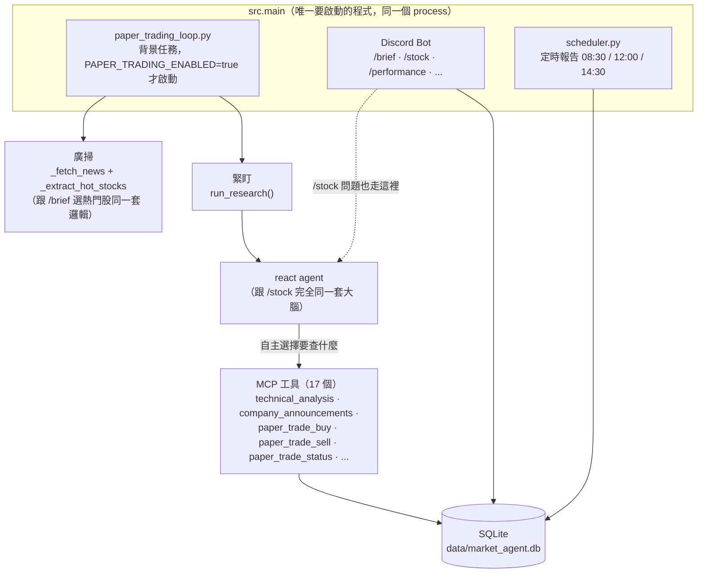
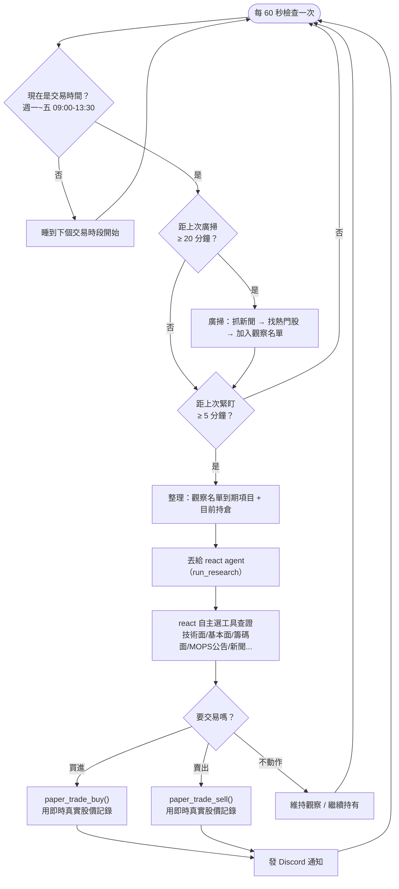

# 紙上交易迴圈（Paper Trading Loop）

實驗性功能：在台股交易時間內持續運作、自己判斷買賣的模擬交易背景任務。完全不牽涉真實資金或第三方交易帳戶——原本評估過接 CMoney 大富翁模擬帳戶，但它的登入系統已經換成 OIDC，唯一的第三方套件已經失效多年，所以改成自己記帳、自己算損益。

## 跟核心功能的關係

**只有一個程式要啟動：`uv run python -m src.main`**。紙上交易迴圈是這個 Discord bot 啟動時，依 `.env` 的 `PAPER_TRADING_ENABLED` 開關決定要不要一起以背景任務啟動——不是另一個要分別啟動的程式。

之後如果要正式上線自動交易，只要把 `PAPER_TRADING_ENABLED` 關掉，核心的查股票/`/brief`/`/stock` 功能完全不受影響——這是特意這樣設計的：`paper_trading_loop.py` 是獨立模組，跟 `/brief` 那條固定抓取路徑不共用 prompt、不共用觸發時機；跟 `/stock` 用的則是**同一套** react 大腦，只是多了三個工具可以用。

真正要留意的 trade-off：因為現在共用同一個 process，紙上交易迴圈如果哪天真的丟出沒接住的例外把整個 process 弄掛，Discord bot 也會跟著死掉（反之亦然）。`run()` 已經把每個週期包在 try/except 裡、錯誤只會被記錄不會往外炸，風險不高，但這是唯一真的要拿來換的東西。

## 決策依據什麼資訊——為什麼交給 react 而不是固定 prompt

一開始的設計是「固定抓技術面/基本面/籌碼面數據，餵給一個專屬的小 prompt 判斷」——保證每次都不會漏查，但看到的資料範圍被寫死。討論後改成現在這樣：**候選股怎麼找是固定的（廣掃），但買賣怎麼判斷交給 react 自己決定要查什麼**（跟你直接問「台積電要不要買」用的是同一套 `run_research()`）。

這牽涉一個明確的取捨，值得寫下來：`claude -p` 沒有辦法強制它一定要呼叫某個工具（沒有 API 那種 `tool_choice` 參數），所以讓它自由選工具，代表理論上某一輪它可能「懶得查」MOPS 公告——這正是 [ADR 0001](adr/0001-drop-langgraph-delegate-to-claude-code.md) 當初把 `daily_brief` 做成固定抓取、不讓 LLM 決定要不要查的理由。紙上交易迴圈是無人值守自動跑的，跟 `daily_brief` 是同一種情境，理論上也該用固定抓取——但這裡刻意選了跟 `react` 一樣的自由工具模式，因為看得到的資訊範圍更完整（新聞、MOPS、社群訊號都能自己查），對「要不要交易」這種需要綜合判斷的決策更合適，而且已經在 `REACT_SYSTEM` 裡加了規則要求它下單前務必先查證真實數據（見下方流程圖的「自主選擇」節點）。實測一輪緊盯可能跑到 20 個 agentic turns、花費比固定 prompt 版本高好幾倍，這是換來的真實代價。

### 交易工具跟查詢工具的清單是分開的

因為交易決策也是走 `run_research()`（跟 `/stock` 同一個函式），一開始 `paper_trade_buy`/`paper_trade_sell` 是跟 `technical_analysis` 那些查詢工具放在同一份工具清單裡——代表你打 `/stock 2330` 只是想看技術面，Claude 手上卻也拿得到下單工具，理論上可能「順便」幫你買一張。

修法是把工具清單拆成兩份（`src/llm_claude_code.py`）：

- `USER_FACING_TOOL_NAMES`（14 個，不含交易工具）—— `run_research()` 的預設值，`/stock`、自由問答都用這份
- `ALL_TOOL_NAMES`（17 個，含交易工具）—— 只有 `paper_trading_loop.py` 呼叫 `run_research()` 時明確傳入這份

這樣「查股票」的對話**物理上**沒有下單工具可以用，不是靠 prompt 裡寫規則約束。

## 運作方式

只在台股交易時間內動作（週一到週五 09:00–13:30，其餘時間直接睡到下個交易時段開始，不會浪費 API 成本查休市的行情）。

持有中的部位跟觀察名單用同一個「緊盯」頻率查（每 5 分鐘），這是「看上的、手上有的查得更勤」的具體做法——不像廣掃只有每 20 分鐘一次。

進出場價格一律來自 `paper_trade_buy`/`paper_trade_sell` 工具自己即時查到的真實股價，不是 LLM 自己講的數字——跟這專案其他所有功能同一個原則。

## 資料存在哪

`paper_positions` 表（`src/memory/store.py`），一個部位一列，紀錄開倉價/日期/理由，平倉後補上出場價/日期/原因。觀察名單本身只存在記憶體裡，不寫進資料庫——程序重啟就會用新的一次廣掃重新建立；觀察名單裡一直沒被買進的候選股，2 小時後也會自動過期移除（`WATCHLIST_TTL`），避免無限累積。

## 查看結果

在 Discord 打 `/performance`：持有中的部位顯示浮動損益、已平倉的顯示實現損益，外加整體勝率/平均報酬（只計算已平倉的）。

有真的買進/賣出時，也會直接發一則訊息到你設定的 `SCHEDULE_REPORT_CHANNEL_ID` 頻道。

## 目前沒做的

- 沒有硬性停損/停利門檻——完全靠 react 每次判斷，沒有「跌超過 X% 強制賣出」這種保險機制
- 觀察名單重啟會清空（設計上如此，見上）
- 只支援做多（買進→賣出），沒有放空
